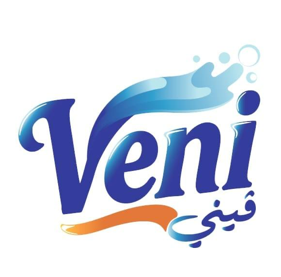

# 🌟 Veni - From Oman to the World

<div align="center">
  
  <p><strong>Our Journey Begins</strong></p>
</div>

## 📋 نبذة عن المشروع

**Veni** هو موقع إلكتروني لشركة عمانية متخصصة في تقديم منتجات التنظيف والعناية الشخصية عالية الجودة. نسعى لتقديم حلول فعالة ومبتكرة تجعل النظافة أسلوب حياة مع الحفاظ على صحة الإنسان والبيئة.

## ✨ المميزات

- 🏠 **صفحة رئيسية جذابة** مع عرض المنتجات
- 🧴 **ثلاث فئات رئيسية:**
  - منتجات التنظيف المنزلية
  - مراجع وتعاليم عالية النشاط
  - مجموعة العناية الشخصية
- 📱 **تصميم متجاوب** يعمل على جميع الأجهزة
- 🎨 **واجهة مستخدم حديثة** باستخدام Bootstrap 5
- ⚡ **أداء عالي** مع React 19

## 🛠️ التقنيات المستخدمة

- **React** (v19.2.0)
- **React Router DOM** (v7.9.3) - للتنقل بين الصفحات
- **Bootstrap** (v5.3.8) - للتصميم
- **Bootstrap Icons** (v1.13.1) - للأيقونات

## 🚀 البدء مع المشروع

### المتطلبات الأساسية

- Node.js (الإصدار 14 أو أحدث)
- npm أو yarn

### التثبيت

```bash
# استنساخ المشروع
git clone <repository-url>

# الانتقال إلى مجلد المشروع
cd veni

# تثبيت الحزم
npm install
```

### تشغيل المشروع

```bash
# تشغيل وضع التطوير
npm start
```

افتح [http://localhost:3000](http://localhost:3000) لعرض المشروع في المتصفح.

### بناء المشروع للإنتاج

```bash
# إنشاء نسخة الإنتاج
npm run build
```

سيتم إنشاء مجلد `build` يحتوي على الملفات المحسّنة والجاهزة للنشر.

### تشغيل الاختبارات

```bash
# تشغيل الاختبارات
npm test
```

## 📁 هيكل المشروع

```
veni/
├── public/
├── src/
│   ├── Components/
│   │   ├── Home/
│   │   │   ├── Home.jsx
│   │   │   └── Home.css
│   │   ├── Navbar/
│   │   │   ├── Navbar.jsx
│   │   │   └── Navbar.css
│   │   ├── Footer/
│   │   │   ├── Footer.jsx
│   │   │   └── Footer.css
│   │   ├── Layout/
│   │   │   ├── Layout.jsx
│   │   │   └── Layout.css
│   │   └── images/
│   ├── App.js
│   ├── App.css
│   └── index.js
├── package.json
└── README.md
```

## 🎯 خطط المستقبل

- [ ] إضافة صفحة "من نحن"
- [ ] إضافة صفحة "المنتجات" مع تفاصيل كاملة
- [ ] إضافة صفحة "اتصل بنا" مع نموذج تواصل
- [ ] إضافة قسم Footer احترافي
- [ ] دعم اللغة العربية والإنجليزية
- [ ] إضافة سلة تسوق
- [ ] ربط مع API خلفي

## 🤝 المساهمة

نرحب بأي مساهمات لتحسين المشروع!

## 📝 الترخيص

هذا المشروع خاص وغير متاح للاستخدام العام.

## 📞 التواصل

للاستفسارات والمزيد من المعلومات، يرجى التواصل معنا.

---

<div align="center">
  <p>صُنع بـ ❤️ في عُمان</p>
  <p><strong>Veni - From Oman to the World</strong></p>
</div>
# Veni
# Veni
# Veni
